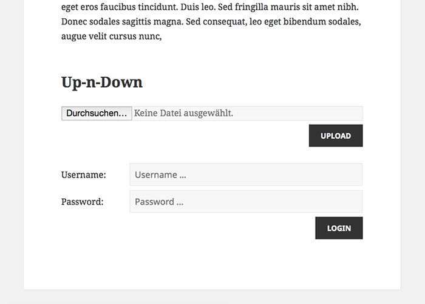
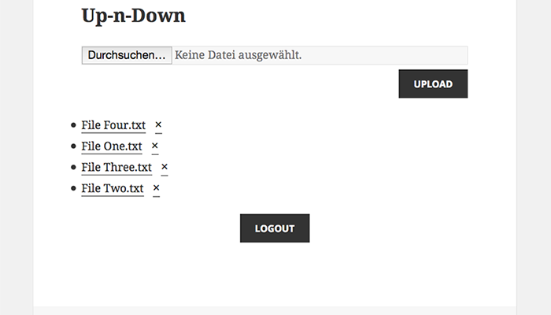
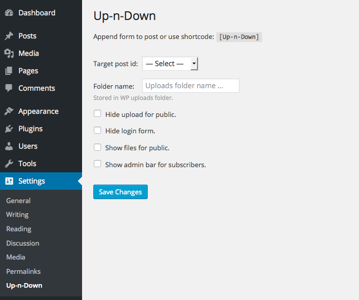

# Up-n-Down #

Up-n-Down is a WordPress plugin which allows to upload files for public
users and also allow the download of this files for registered users.
It has a settings menu which allows to

* Change post for appending.
* Change folder name in WordPress uploads folder.
* Hide upload form for public.
* Hide login form.
* Show files for public
* Show admin bar for subscribers.

Up-n-Down can also be used as shortcode `[Up-n-Down]`.

## Screenshots ##

## Requirements (untested) ##

* WordPress 3+
* PHP 5+

## TODO ##

* [ ] Translate plugin.
* [ ] Allow upload of multiple files.
* [x] Check file MIME-Type.
* [x] Basic style.
* [x] Add screenshots.
